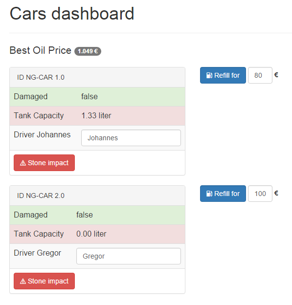

# Dependecy Injection und Unit-Testing mit Angular 2.0 -- Beispiele

In diesem Verzeichnis finden Sie das im Artikel gezeigte Beispiel unter `src/`.



## Setup & Start

Alle gezeigten Kommandozeilen-Befehle setzen voraus, dass [Node.js](https://nodejs.org/) installiert ist. 

```cmd
$ npm install
$ npm start
```

Nach `npm start` öffnet sich der Standard-Browser und zeigt die Demo "Cars Dashboard" an.

Die Unit-Tests werden mit `karma start` bzw.

```
npm test
```

ausgeführt.